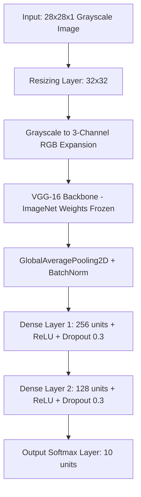

# MNIST CNN VGG-16 Transfer Learning Studio

An end-to-end Deep Learning application using **TensorFlow/Keras** for MNIST digit recognition, built with a **VGG-16 Transfer Learning** architecture and a modern, full-featured web interface.

---

## 🌟 Key Features

1. **VGG-16 Transfer Learning CNN Model**:
   - Adapts $28 \times 28$ grayscale MNIST digits into the pre-trained ImageNet VGG-16 backbone.
   - 2 custom Dense layers on top (`dense_1`: 256 units + ReLU + Dropout, `dense_2`: 128 units + ReLU + Dropout) + 10-class Softmax.
2. **Real-Time Live Weight & Bias Monitoring**:
   - Live dynamometer tracking weight and bias updates ($\Delta W, \Delta b$, relative update %, mean $\pm$ std, min/max).
   - Real-time layer weight distribution histogram.
   - Dynamic Chart.js Loss and Accuracy convergence curves streamed via WebSockets.
3. **Multi-Mode Digit Inference**:
   - **Interactive Drawing Canvas**: Smooth drawing pad with customizable brush size.
   - **Screenshot & Image Upload**: Drag-and-drop or upload digit images with automatic contrast detection, bounding-box cropping, and center-of-mass centering.
   - **Random MNIST Test Samples**: 1-click test with real test images and ground truth verification.
4. **Standalone CLI Pipelines**:
   - `train.py`: Fetch data from Keras, train, save model, and display epoch progress.
   - `test.py`: Comprehensive test set evaluation (accuracy, loss, per-digit precision/recall/F1-score, and sample inferences).
5. **One-Click Startup**:
   - `run_app.bat`: Automatically checks dependencies, boots FastAPI, and opens the app in your browser.

---

## 📂 Project Structure

```
MNIST/
├── backend/
│   ├── __init__.py
│   ├── model.py            # VGG16 model architecture & weight extraction utilities
│   ├── train.py            # Training pipeline with LiveTrainingCallback & CLI
│   ├── test.py             # Model evaluation on 10,000 test images & report
│   ├── main.py             # FastAPI server with WebSockets & REST APIs
│   └── requirements.txt    # Python dependencies
├── frontend/
│   ├── index.html          # Modern 2-tab user interface
│   ├── style.css           # Premium dark theme with glassmorphism & neon glow
│   └── app.js              # WebSocket client, Chart.js live charts, canvas logic
├── models/                 # Stores saved models (.keras / .h5) & training logs
├── run_app.bat             # One-click Windows batch launcher
└── README.md               # Documentation
```

---

## 🚀 Quick Start (Single Click)

Double-click **`run_app.bat`** in the project root:
- Automatically installs required dependencies.
- Starts the FastAPI server on `http://localhost:8000`.
- Launches your default browser to the web studio.

---

## 💻 Manual Setup & CLI Usage

### 1. Install Dependencies
```bash
pip install -r backend/requirements.txt
```

### 2. Standalone Training via CLI
```bash
# Fast training with 5,000 sample subset (ideal for CPU)
python backend/train.py --epochs 5 --subset 5000 --batch_size 64

# Full MNIST dataset (60,000 samples)
python backend/train.py --epochs 10 --batch_size 128 --lr 0.001
```

### 3. Standalone Testing & Evaluation via CLI
```bash
python backend/test.py
```

### 4. Run Web Application Server
```bash
python backend/main.py
```
Open **`http://localhost:8000`** in your browser.

---

## 🧠 Model Architecture


